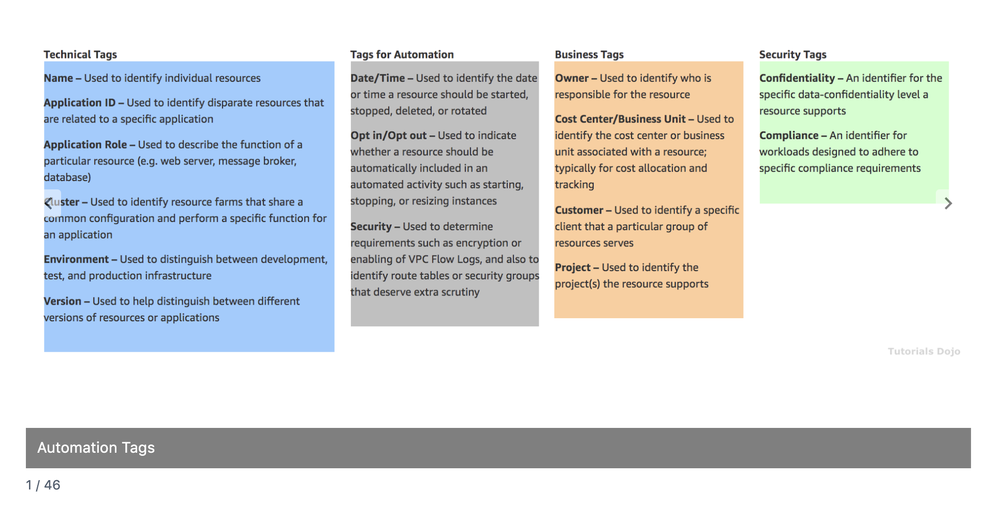
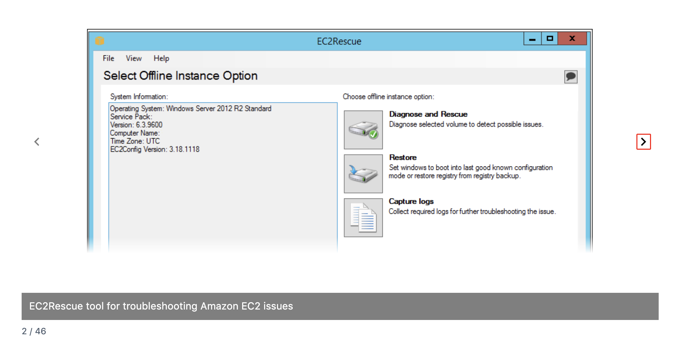
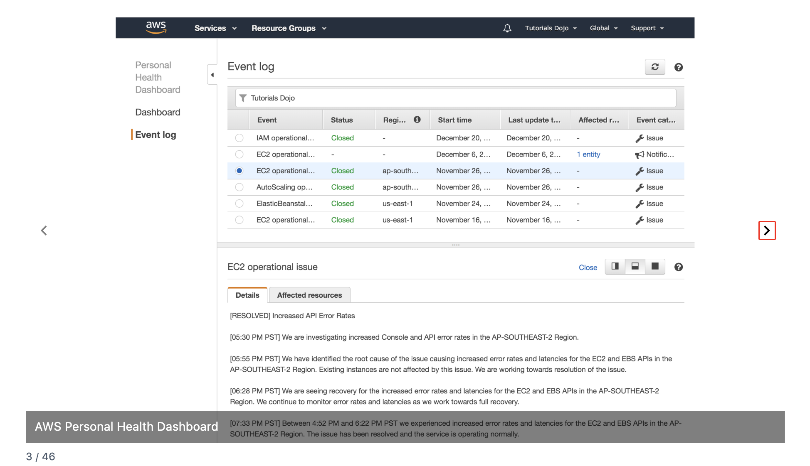
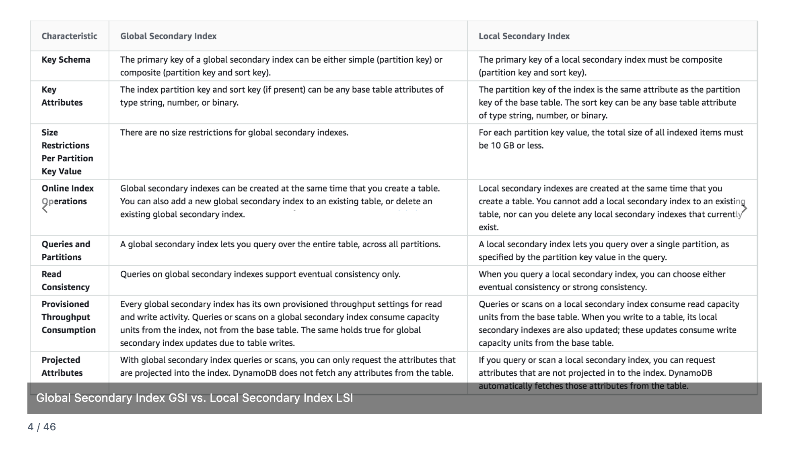
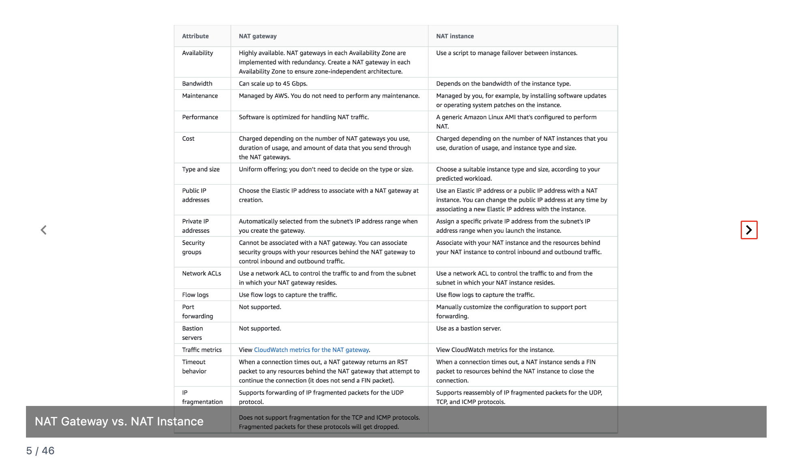
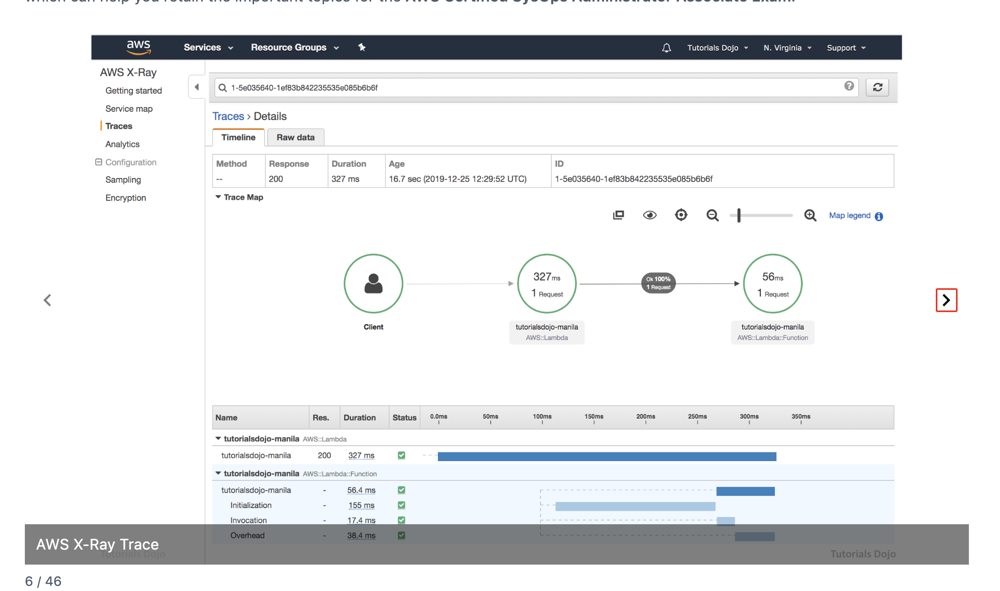
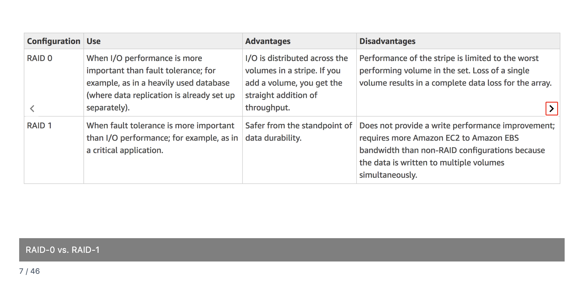
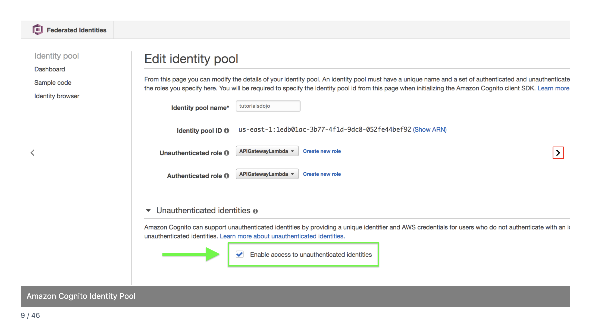
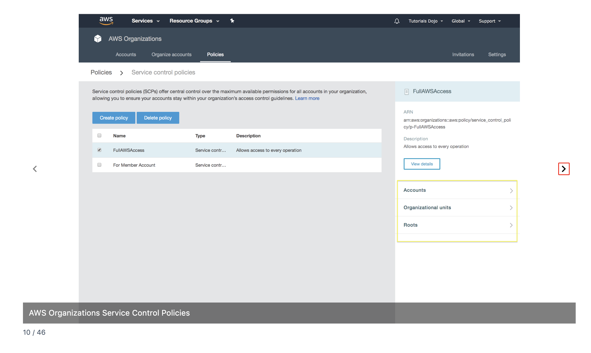

# AWS CloudOps Exam Study Notes
## Flashcards 1-10 Quick Reference

---


## 1. Automation Tags



**What it is:** Key-value labels you attach to AWS resources for organization, automation, cost tracking, and security.

**Four Categories:**

| Category | Purpose | Example Key-Value |
|----------|---------|-------------------|
| **Technical Tags** | "What IS this thing?" | `Environment=prod`, `ApplicationRole=web-server` |
| **Tags for Automation** | "What should robots do?" | `AutoStop=true`, `DeleteAfter=2026-01-15` |
| **Business Tags** | "Who owns/pays for this?" | `CostCenter=CC-4892`, `Project=MobileApp` |
| **Security Tags** | "How sensitive is this?" | `Compliance=HIPAA`, `Confidentiality=high` |

**Key Insight:** Tags alone do nothing. Tags + something else = power.
- Tags + Cost Explorer = cost visibility
- Tags + IAM = access control (ABAC)
- Tags + Lambda/Systems Manager = automation
- Tags + AWS Config = compliance checking

**Exam Trigger:** "Track spending by project" → Business Tags + Cost Explorer

---

## 2. EC2Rescue Tool



**What it is:** Emergency toolkit for troubleshooting EC2 instances that won't boot or are unreachable.

**The Problem:** How do you fix a computer you can't log into?

**How It Works (Volume Transplant Surgery):**
1. STOP broken instance
2. DETACH its root EBS volume
3. LAUNCH healthy "helper" instance
4. ATTACH broken volume to helper
5. RUN EC2Rescue on the attached volume
6. REATTACH to original instance
7. START original instance

**Why the helper instance?** You can't run diagnostics on a volume that's actively being used as a boot drive. You need to examine it "from the outside."

**Two Versions:**
- EC2Rescue for Linux (command-line)
- EC2Rescue for Windows (GUI)

**Automation:** Use `AWSSupport-ExecuteEC2Rescue` Systems Manager automation document.

**Exam Triggers:** "Instance won't boot," "Failed status checks," "Cannot connect via SSH/RDP"

---

## 3. Personal Health Dashboard



**What it is:** Personalized view of AWS service health that affects YOUR specific resources.

**Key Distinction:**

| Service Health Dashboard | Personal Health Dashboard |
|--------------------------|---------------------------|
| Public, shows ALL of AWS | Private, shows YOUR resources |
| "EC2 has issues in us-east-1" | "YOUR instance i-0abc123 is affected" |

**Why It Matters:**
- Proves whether outages were AWS's fault or yours
- Shows exactly which of YOUR resources were impacted
- Integrates with EventBridge for automated responses

**Automation Pattern:**
```
Personal Health Dashboard → EventBridge → Lambda/SNS
```

**Exam Trigger:** "Notified when AWS maintenance affects their resources" → Personal Health Dashboard + EventBridge

---

## 4. GSI vs LSI (DynamoDB Indexes)



**What they solve:** Fast queries on attributes other than the primary key.

**Simple Difference:**

| GSI (Global Secondary Index) | LSI (Local Secondary Index) |
|------------------------------|----------------------------|
| "Build a different phone book" | "Add tabs to the same phone book" |
| Any partition key | SAME partition key as base table |
| Create/delete anytime | Only at table creation |
| Eventual consistency ONLY | Eventual OR strong consistency |
| No size limit | 10 GB per partition key limit |
| Separate throughput capacity | Shares base table capacity |

**Memory Trick:**
- **L**ocal = **L**ocked (same partition key, locked at creation, but **L**uxury of strong consistency)
- **G**lobal = **G**o anywhere (create anytime, any key, **G**ive up strong consistency)

**Exam Triggers:**
- "Table already exists, need new index" → GSI only option
- "Strongly consistent reads on index" → LSI required
- "Query by completely different attribute" → GSI

---

## 5. NAT Gateway vs NAT Instance



**What NAT solves:** Lets private subnet instances reach the internet (outbound) without being reachable from the internet (inbound).

**Key Differences:**

| Attribute | NAT Gateway | NAT Instance |
|-----------|-------------|--------------|
| Managed by | AWS | You |
| Availability | Built-in redundancy per AZ | You script failover |
| Bandwidth | Up to 45 Gbps auto-scaling | Limited by instance type |
| Security Groups | Cannot attach | Can attach |
| Bastion Host | Cannot use as | Can double as |
| Cost | More expensive | Cheaper |

**Critical Exam Trap:** NAT Gateway does NOT failover across AZs. Deploy one per AZ for high availability.

**Exam Decision Tree:**
- "Least operational overhead" → NAT Gateway
- "Most cost-effective" + low traffic + skilled team → NAT Instance
- "Bastion + NAT in one" → NAT Instance
- "High availability" → NAT Gateway in each AZ

---

## 6. AWS X-Ray



**What it is:** Distributed tracing — follows a single request through multiple services to find bottlenecks.

**The Problem:** Your app is slow, but it's made of 10 services. Which one is the problem?

**Key Terms:**

| Term | Meaning |
|------|---------|
| **Trace** | Entire journey of one request |
| **Segment** | One service's piece (e.g., "Lambda took 327ms") |
| **Subsegment** | Breakdown within a segment (e.g., "DynamoDB call took 50ms") |

**X-Ray vs CloudWatch vs CloudTrail:**

| Service | Question It Answers |
|---------|---------------------|
| CloudWatch | "How is this service performing overall?" |
| CloudTrail | "Who did what in my AWS account?" |
| X-Ray | "What happened to THIS request across all services?" |

**Exam Triggers:** "Debug latency in distributed application," "Trace requests across services," "Identify bottlenecks"

---

## 7. RAID 0 vs RAID 1



**What RAID is:** Combining multiple disks (EBS volumes) to work together.

**Simple Difference:**

| RAID 0 (Striping) | RAID 1 (Mirroring) |
|-------------------|-------------------|
| Split data across disks | Duplicate data on both disks |
| 2x speed | No speed boost (writes) |
| 0 protection | Full protection |
| One disk dies = ALL data lost | One disk dies = no data lost |
| 2 × 100GB = 200GB usable | 2 × 100GB = 100GB usable |

**Memory Trick:**
- RAID **0** = **0** protection (fast but risky)
- RAID **1** = **1** extra copy (safe but no speed boost)

**Exam Triggers:**
- "Maximize I/O performance" → RAID 0
- "Fault tolerance for storage" → RAID 1
- "Data replication handled separately" → RAID 0 is safe to use

---

## 8. AWS Config Custom Rule Trigger Types


**What AWS Config is:** Compliance cop that checks if resources are configured correctly.

**Two Trigger Types:**

| Configuration Changes | Periodic |
|-----------------------|----------|
| Fires when something changes | Fires on a schedule (1hr, 6hr, 24hr) |
| Real-time detection | Regular sweeps |
| Catches new violations instantly | Catches pre-existing violations |

**Why Use BOTH Together?**
- Configuration changes misses resources created BEFORE the rule existed
- Periodic catches pre-existing violations but delays detection of new ones
- Both = real-time alerts + safety net sweeps

**AWS Config vs CloudTrail:**

| CloudTrail | AWS Config |
|------------|------------|
| "WHO did WHAT?" | "Is this configured CORRECTLY?" |
| Audit log | Compliance evaluation |

**Exam Triggers:**
- "Immediately when resource changes" → Configuration changes trigger
- "Daily compliance check" → Periodic trigger
- "Custom compliance logic" → Custom rule with Lambda

---

## 9. Cognito Identity Pool (Unauthenticated Identities)



**Two Parts of Cognito:**

| User Pool | Identity Pool |
|-----------|---------------|
| "Who are you?" | "What can you access?" |
| Sign-up, sign-in, passwords | Temporary AWS credentials |
| Authentication | Authorization |

**Unauthenticated Identities:** Give limited AWS access to users who haven't logged in (guests).

**Why Use It?**
- Let users browse before creating an account
- Better UX, lower friction
- Guest gets minimal permissions; logged-in users get more

**Two Roles:**

| Unauthenticated Role | Authenticated Role |
|----------------------|-------------------|
| Guests, not logged in | Logged-in users |
| Very limited access | More access |

**Key Point:** Permissions are controlled by the IAM policy attached to the role, not Cognito itself.

**Exam Triggers:**
- "Mobile app access AWS before sign-in" → Cognito Identity Pool + unauthenticated
- "Temporary credentials for guests" → Cognito Identity Pool

---

## 10. Service Control Policies (SCPs)



**What it is:** Organization-wide guardrails that set MAXIMUM permissions for all accounts.

**Hierarchy:**
```
Root (entire organization)
  └── Organizational Unit (OU) — folder of accounts
        └── Account — individual AWS account
```

**SCPs Inherit Downward:** Apply to Root → all accounts get it. Apply to OU → all accounts in that OU get it.

**Critical Concept:** SCPs don't GRANT permissions. They set maximum boundaries.

```
IAM: Allow     +  SCP: Allow    =  ✅ Allowed
IAM: Allow     +  SCP: Deny     =  ❌ Denied (SCP wins)
```

**SCP vs IAM Permission Boundary:**

| SCP | Permission Boundary |
|-----|---------------------|
| Applies to entire accounts | Applies to individual users/roles |
| Multi-account governance | Delegating user creation |

**Handling Exceptions:** You can only get MORE restrictive going down. If Root denies something, it's denied everywhere. For exceptions, restructure OUs and don't apply restrictive SCPs at Root.

**Exam Triggers:**
- "Prevent ALL accounts from..." → SCP
- "Even administrators cannot..." → SCP
- "Centrally restrict across organization" → SCP

---

## Quick Exam Decision Guide

| When you see... | Think... |
|-----------------|----------|
| "Track costs by project" | Tags + Cost Explorer |
| "Instance won't boot" | EC2Rescue |
| "AWS outage affected my resources?" | Personal Health Dashboard |
| "Need new index on existing table" | GSI |
| "Strong consistency on index" | LSI |
| "Private subnet internet access, least effort" | NAT Gateway |
| "Bastion + NAT combined" | NAT Instance |
| "Where is latency in my distributed app?" | X-Ray |
| "Maximum disk throughput" | RAID 0 |
| "Disk fault tolerance" | RAID 1 |
| "Compliance check when resource changes" | Config: Configuration changes trigger |
| "Daily compliance sweep" | Config: Periodic trigger |
| "Guest access to AWS services" | Cognito Identity Pool + unauthenticated |
| "Restrict all accounts organization-wide" | SCP |