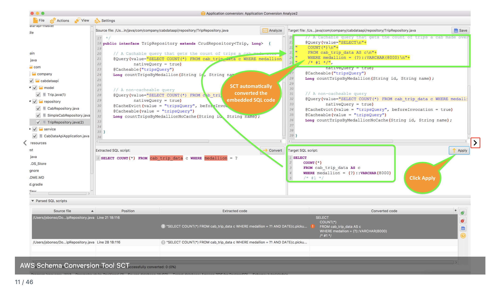
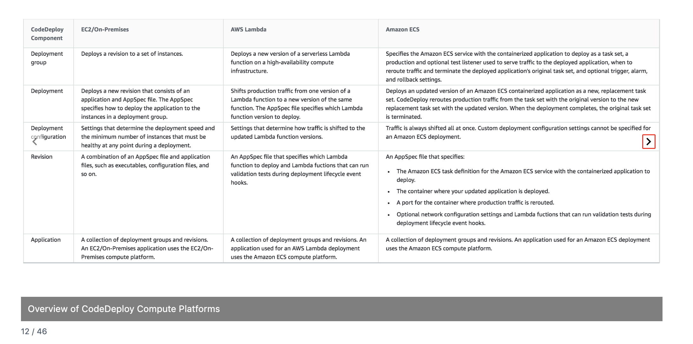
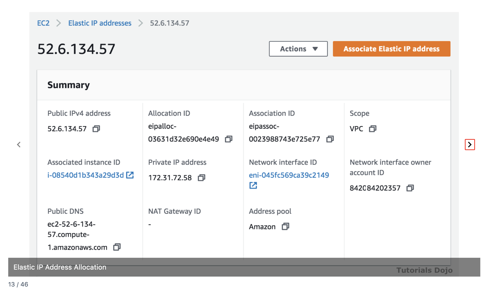
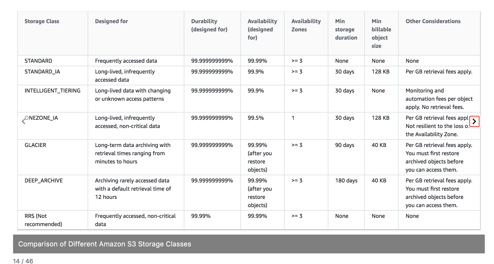
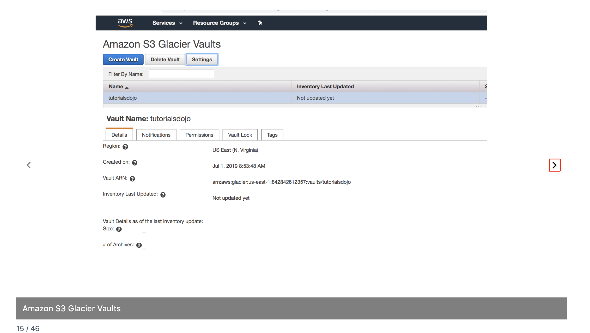
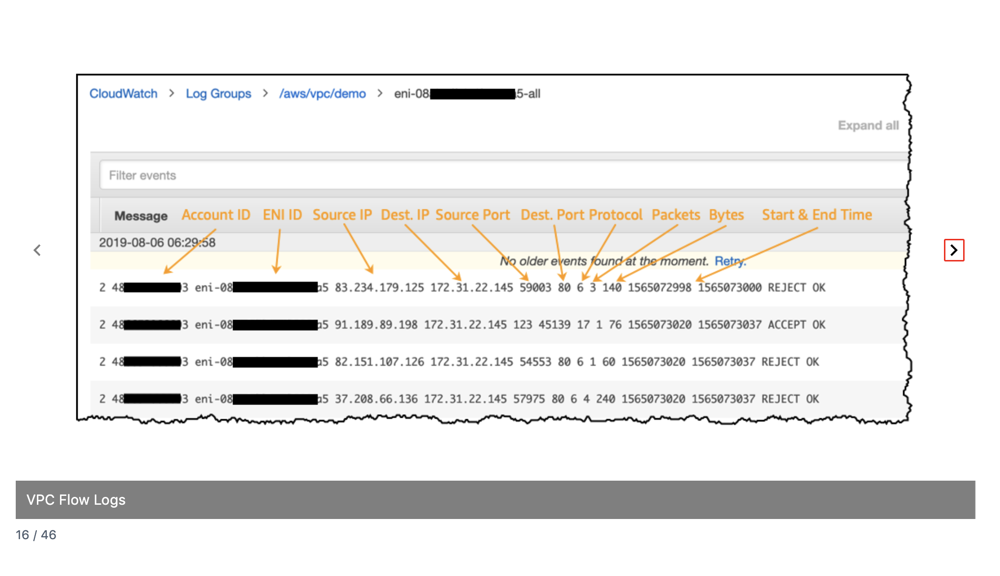
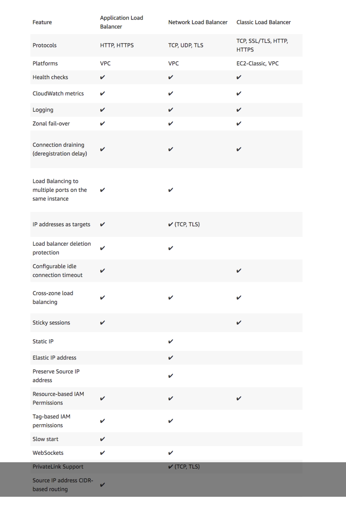
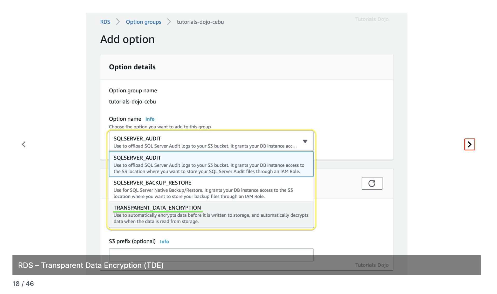
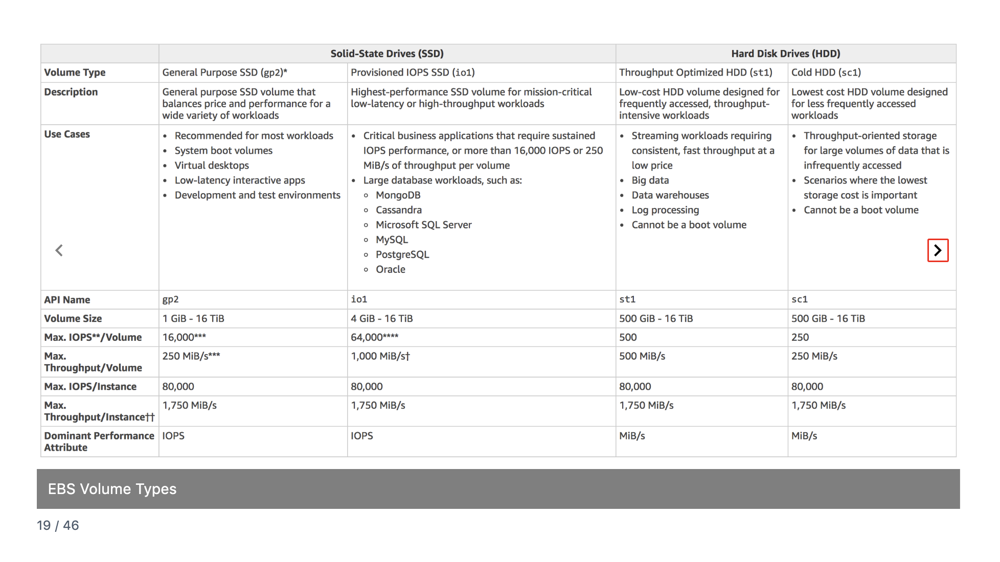
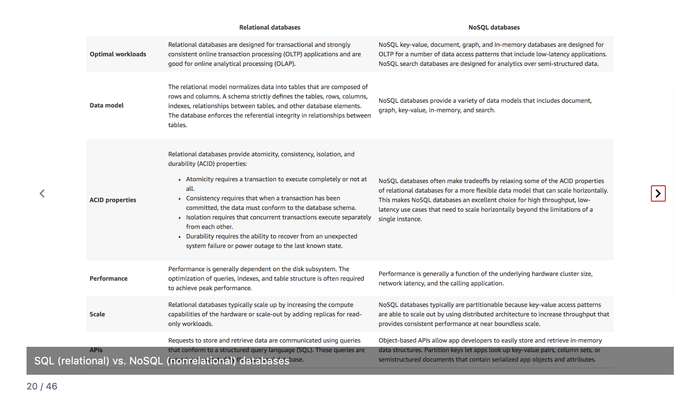

# AWS CloudOps Exam Study Notes
## Flashcards 11-20 Quick Reference

---

## 11. AWS Schema Conversion Tool (SCT)

**What it is:** Converts database schemas and application code from one database engine to another during migrations.

**The Problem:** Migrating from Oracle to PostgreSQL? They have different SQL syntax, data types, and stored procedure languages. Manually rewriting everything takes months.

**SCT vs DMS:**

| AWS SCT | AWS DMS |
|---------|---------|
| Converts **schema and code** | Moves **data** |
| "Translate the structure" | "Move the contents" |
| Run once before migration | Can run continuously |

**Heterogeneous vs Homogeneous:**

| Migration Type | Example | SCT Needed? |
|----------------|---------|-------------|
| Heterogeneous | Oracle → PostgreSQL | ✅ Yes |
| Heterogeneous | SQL Server → Aurora PostgreSQL | ✅ Yes |
| Homogeneous | MySQL → Aurora MySQL | ❌ No (same engine) |

**Key Feature:** Assessment Report — shows what % can be auto-converted vs needs manual work.

**Exam Triggers:**
- "Migrate from Oracle to Aurora" → SCT + DMS
- "Convert stored procedures" → SCT
- "Assess migration complexity" → SCT Assessment Report
- "Heterogeneous database migration" → SCT required

---

## 12. CodeDeploy Compute Platforms

**What it is:** Automates application deployments to EC2, Lambda, and ECS.

**Three Compute Platforms:**

| Platform | How It Deploys | Traffic Control |
|----------|----------------|-----------------|
| **EC2/On-Premises** | Agent pulls code, runs scripts | Control how many instances update |
| **Lambda** | Shifts traffic between function versions | Canary, Linear, or AllAtOnce |
| **ECS** | Replaces task sets | AllAtOnce only |

**Key CodeDeploy Concepts:**

| Concept | What It Is |
|---------|------------|
| **Application** | Top-level container |
| **Deployment Group** | WHERE to deploy (set of instances/functions) |
| **Revision** | WHAT to deploy (code + AppSpec file) |
| **Deployment Configuration** | HOW FAST (AllAtOnce, HalfAtATime, Canary, Linear) |

**Lambda Deployment Strategies:**

| Strategy | Behavior |
|----------|----------|
| **Canary** | X% first, wait, then 100% |
| **Linear** | X% every Y minutes (gradual ramp) |
| **AllAtOnce** | Immediate 100% |

**Exam Triggers:**
- "Automate deployments to EC2" → CodeDeploy
- "Gradually shift Lambda traffic" → CodeDeploy Canary/Linear
- "AppSpec file" → CodeDeploy
- "10% traffic first, then all" → Canary deployment

---

## 13. Elastic IP Address Allocation

**What it is:** A static public IPv4 address you own until you release it.

**The Problem:** EC2 public IPs change on stop/start. If partners whitelist your IP, everything breaks.

**Allocation vs Association:**

| Term | Meaning |
|------|---------|
| **Allocate** | Reserve IP for your account (you own it) |
| **Associate** | Attach to a resource (now it's in use) |
| **Disassociate** | Detach (still yours, just unused) |
| **Release** | Return to AWS (you no longer own it) |

**Cost Trap — Exam Favorite:**

| Scenario | Cost |
|----------|------|
| EIP associated with running instance | Free |
| EIP allocated but NOT associated | 💰 Charged |
| EIP associated with STOPPED instance | 💰 Charged |
| More than one EIP on running instance | 💰 Charged (for extras) |

**EIP vs Auto-Assigned Public IP:**

| Auto-Assigned Public IP | Elastic IP |
|-------------------------|------------|
| Changes on stop/start | Never changes |
| Free | Free only when in use |
| Can't move | Can reassign to another instance |

**ENI Relationship:** EIPs can attach to an ENI (Elastic Network Interface) instead of directly to an instance. This allows faster failover — move the ENI with its EIP to another instance in one action.

**NAT Gateway Requirement:** NAT Gateway REQUIRES an Elastic IP. Cannot use auto-assigned.

**Exam Triggers:**
- "Static public IP" → Elastic IP
- "IP persists after stop/start" → Elastic IP
- "Charges for unused IP" → EIP not associated
- "NAT Gateway requires" → Elastic IP

---

## 14. S3 Storage Classes

**Quick Reference:**

| Storage Class | Use Case | Retrieval | Min Duration |
|---------------|----------|-----------|--------------|
| **Standard** | Frequently accessed | Instant | None |
| **Standard-IA** | Infrequent, but needs fast access | Instant | 30 days |
| **One Zone-IA** | Infrequent, non-critical | Instant | 30 days |
| **Intelligent-Tiering** | Unknown access patterns | Instant | 30 days |
| **Glacier Instant** | Archive, rare but instant access | Instant | 90 days |
| **Glacier Flexible** | Archive, minutes to hours | Minutes-hours | 90 days |
| **Glacier Deep Archive** | Long-term archive | 12 hours | 180 days |

**Key Insight:** One Zone-IA has only 99.5% availability (vs 99.9%+ for others) and is NOT resilient to AZ loss.

**Exam Triggers:**
- "Lowest cost archive" → Glacier Deep Archive
- "Unknown access patterns" → Intelligent-Tiering
- "Infrequent but immediate access" → Standard-IA

---

## 15. S3 Glacier Vaults

**What it is:** Container for Glacier archives with access policies and vault locks.

**Key Concepts:**

| Term | Meaning |
|------|---------|
| **Vault** | Container for archives (like an S3 bucket) |
| **Archive** | Data stored in vault (like an S3 object) |
| **Vault Lock** | Immutable compliance policy (WORM) |

**Vault Lock:** Once locked, policy CANNOT be changed. Used for compliance (SEC, FINRA) requiring Write-Once-Read-Many.

**Exam Triggers:**
- "Compliance requires immutable retention" → Vault Lock
- "WORM storage" → Glacier Vault Lock

---

## 16. VPC Flow Logs

**What it is:** Captures metadata about IP traffic to/from network interfaces. Like a security camera that records who came and went, but not what they said.

**Three Levels:**

| Level | Captures |
|-------|----------|
| **VPC** | All traffic in entire VPC |
| **Subnet** | All traffic in that subnet |
| **ENI** | Traffic for one network interface |

**Log Destinations:**

| Destination | Use Case |
|-------------|----------|
| **CloudWatch Logs** | Real-time monitoring, alerts |
| **S3** | Long-term storage, query with Athena |
| **Kinesis Data Firehose** | Stream to analytics |

**Reading Flow Logs:**

| Field | Example | Meaning |
|-------|---------|---------|
| Source IP | 83.234.179.125 | Who's connecting |
| Dest IP | 172.31.22.145 | Your resource |
| Dest Port | 80 | HTTP |
| Protocol | 6 | TCP (6=TCP, 17=UDP) |
| Action | REJECT | Blocked by SG/NACL |

**Troubleshooting Guide:**

| You See | Meaning | Likely Cause |
|---------|---------|--------------|
| REJECT | Traffic denied | Security Group or NACL blocking |
| ACCEPT | Traffic allowed | Network layer fine, check app |
| Nothing | Traffic never arrived | Route table issue |

**Exam Triggers:**
- "Troubleshoot connectivity" → VPC Flow Logs
- "Determine if traffic blocked" → Flow Logs (look for REJECT)
- "Query flow logs with SQL" → S3 + Athena
- "Security audit of network traffic" → VPC Flow Logs

---

## 17. ELB Types

**Quick Comparison:**

| Feature | ALB | NLB | CLB |
|---------|-----|-----|-----|
| **Layer** | 7 (HTTP/HTTPS) | 4 (TCP/UDP) | 4 & 7 |
| **Use Case** | Web apps, microservices | Extreme performance, static IP | Legacy |
| **Static IP** | ❌ No | ✅ Yes | ❌ No |
| **Elastic IP** | ❌ No | ✅ Yes | ❌ No |
| **Preserve Source IP** | ❌ No (use X-Forwarded-For) | ✅ Yes | ❌ No |
| **WebSockets** | ✅ Yes | ✅ Yes | ❌ No |
| **Path-based routing** | ✅ Yes | ❌ No | ❌ No |
| **Host-based routing** | ✅ Yes | ❌ No | ❌ No |

**Exam Triggers:**
- "Static IP for load balancer" → NLB
- "Path-based routing" → ALB
- "Extreme performance, millions of requests" → NLB
- "WebSockets support" → ALB or NLB
- "Preserve client source IP" → NLB

---

## 18. RDS Transparent Data Encryption (TDE)

**What it is:** Database-level encryption that automatically encrypts data before writing to disk. "Transparent" = app doesn't know it's happening.

**TDE Availability:**

| Engine | TDE Support |
|--------|-------------|
| SQL Server | ✅ Yes (via Option Group) |
| Oracle | ✅ Yes (via Option Group) |
| MySQL | ❌ No (use RDS Encryption) |
| PostgreSQL | ❌ No (use RDS Encryption) |
| MariaDB | ❌ No (use RDS Encryption) |

**TDE vs RDS Encryption:**

| Aspect | TDE (Option Group) | RDS Encryption (KMS) |
|--------|--------------------|-----------------------|
| **What's encrypted** | Database files | Entire EBS volume |
| **Who encrypts** | Database engine | AWS infrastructure |
| **When to enable** | Anytime | Only at creation |
| **Can disable?** | Yes | No |
| **Engines** | SQL Server, Oracle | All engines |

**Option Groups vs Parameter Groups:**

| Option Groups | Parameter Groups |
|---------------|------------------|
| Enable **features** (TDE, audit) | Configure **settings** (memory, timeouts) |
| "Turn on this capability" | "Set this value" |

**Why Use Both TDE + RDS Encryption?**
- Defense in depth (two layers)
- Compliance requiring both storage AND database encryption
- Different key management options

**Exam Triggers:**
- "Enable TDE on SQL Server" → Option Group
- "Encrypt RDS PostgreSQL at rest" → RDS Encryption (not TDE)
- "Option Group for encryption" → TDE

---

## 19. EBS Volume Types

**Quick Reference:**

| Type | API Name | Use Case | Max IOPS | Boot Volume? |
|------|----------|----------|----------|--------------|
| **General Purpose SSD** | gp2/gp3 | Most workloads | 16,000 | ✅ Yes |
| **Provisioned IOPS SSD** | io1/io2 | Databases, critical apps | 64,000 | ✅ Yes |
| **Throughput Optimized HDD** | st1 | Big data, streaming | 500 | ❌ No |
| **Cold HDD** | sc1 | Infrequent access | 250 | ❌ No |

**SSD vs HDD:**

| SSD (gp2, io1) | HDD (st1, sc1) |
|----------------|----------------|
| Optimized for IOPS | Optimized for throughput (MiB/s) |
| Random reads/writes | Sequential reads/writes |
| Can be boot volume | Cannot be boot volume |

**Exam Triggers:**
- "Database needing high IOPS" → io1/io2
- "Big data, log processing" → st1
- "Lowest cost storage" → sc1
- "Boot volume" → gp2/gp3 or io1/io2 only

---

## 20. SQL vs NoSQL Databases

**Quick Comparison:**

| Aspect | SQL (Relational) | NoSQL |
|--------|------------------|-------|
| **Data Model** | Tables with rows/columns | Document, key-value, graph |
| **Schema** | Fixed, strict | Flexible |
| **Scaling** | Vertical (bigger machine) | Horizontal (more machines) |
| **ACID** | Full compliance | Often relaxed for performance |
| **Best For** | Complex queries, transactions | High throughput, low latency |

**AWS Database Services:**

| SQL (Relational) | NoSQL |
|------------------|-------|
| RDS (MySQL, PostgreSQL, etc.) | DynamoDB (key-value) |
| Aurora | DocumentDB (document) |
| Redshift (analytics) | ElastiCache (in-memory) |
| | Neptune (graph) |

**Exam Triggers:**
- "Complex joins and transactions" → SQL/RDS
- "Millisecond latency at any scale" → DynamoDB
- "Flexible schema" → NoSQL
- "ACID compliance required" → SQL/RDS

---

## Quick Exam Decision Guide

| When you see... | Think... |
|-----------------|----------|
| "Migrate Oracle to PostgreSQL" | SCT + DMS |
| "Same engine migration (MySQL to MySQL)" | DMS only |
| "Automate EC2 deployments" | CodeDeploy |
| "Shift Lambda traffic gradually" | CodeDeploy Canary/Linear |
| "Static public IP" | Elastic IP |
| "Charged for unused IPs" | EIP not associated |
| "NAT Gateway needs public IP" | Elastic IP (required) |
| "Troubleshoot blocked traffic" | VPC Flow Logs → look for REJECT |
| "Query flow logs with SQL" | S3 + Athena |
| "Static IP on load balancer" | NLB |
| "Path-based routing" | ALB |
| "Enable TDE on SQL Server" | Option Group |
| "Encrypt RDS PostgreSQL" | RDS Encryption (not TDE) |
| "High IOPS database" | io1/io2 |
| "Boot volume on HDD" | Not possible (use SSD) |
| "Horizontal scaling, flexible schema" | NoSQL/DynamoDB |
| "Complex transactions" | SQL/RDS |