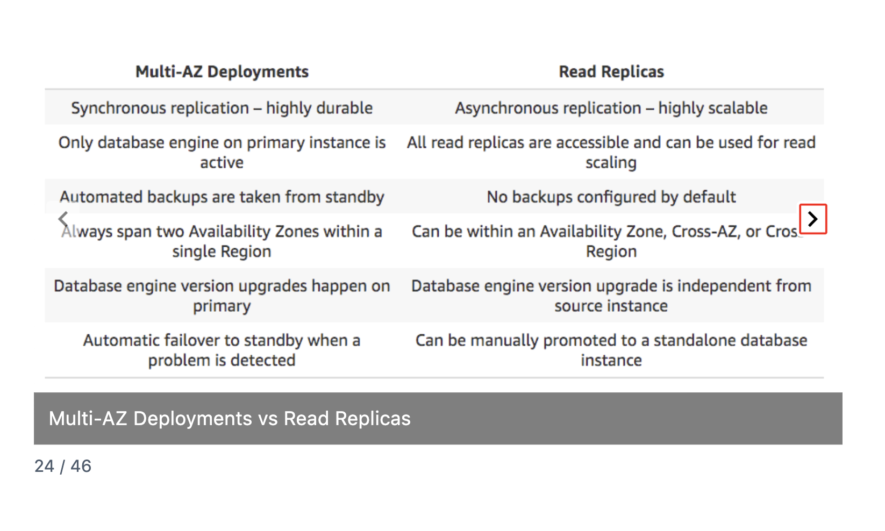
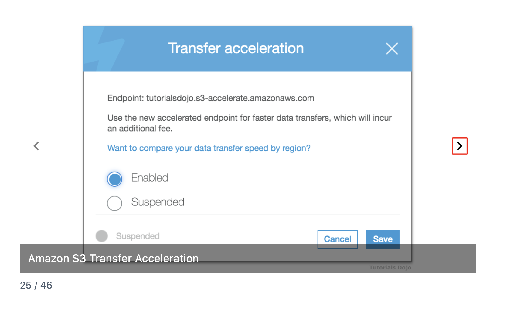
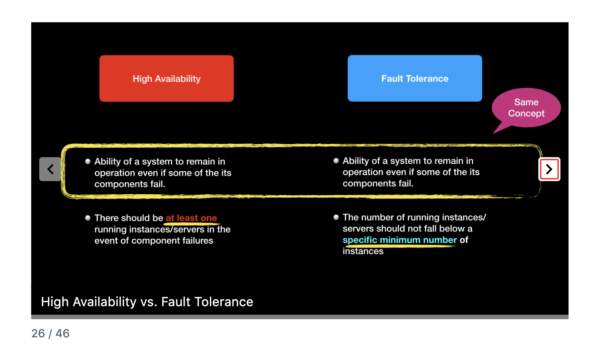
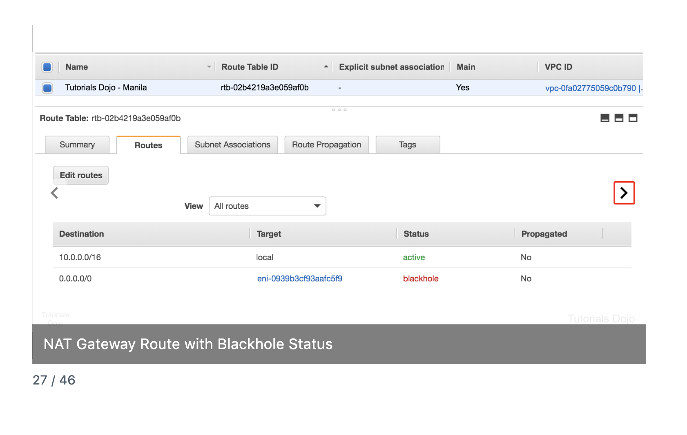
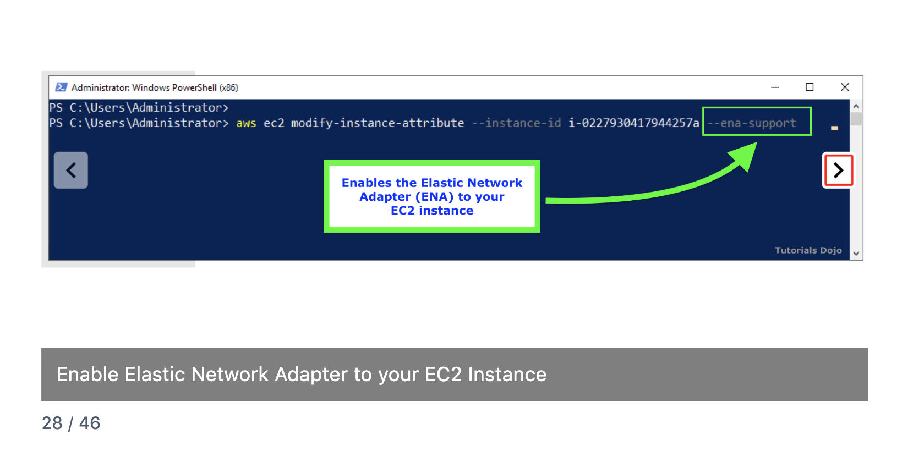
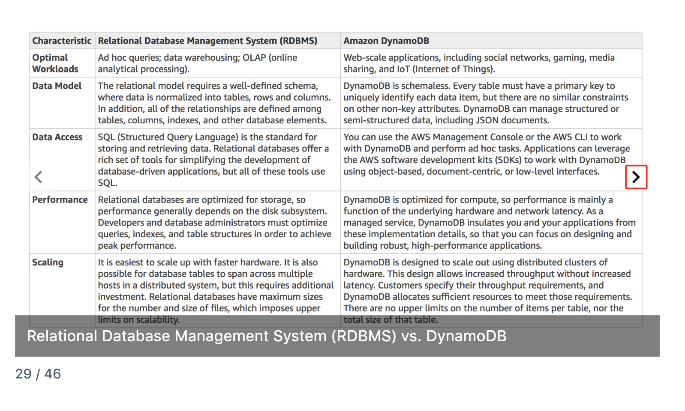
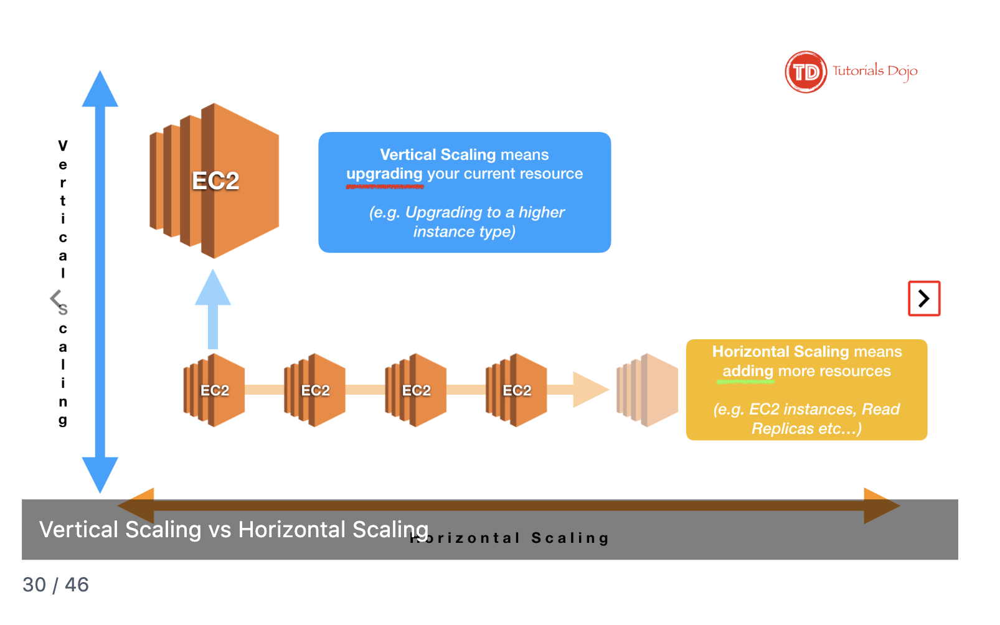

# AWS CloudOps Exam Study Notes
## Flashcards 21-30 Quick Reference

---

## 21. Aurora Reader and Writer Endpoints


**What it is:** Aurora provides different endpoints to route traffic to the right instances automatically.

**Four Endpoint Types:**

| Endpoint | Purpose | Use Case |
|----------|---------|----------|
| **Cluster (Writer)** | Points to primary instance | Writes (INSERT, UPDATE, DELETE) |
| **Reader** | Load balances across replicas | Read scaling |
| **Instance** | Points to one specific instance | Troubleshooting |
| **Custom** | Points to subset you define | Analytics on specific replicas |

**Key Insight:** Use cluster endpoint, NOT instance endpoint. Instance endpoints don't redirect after failover.

**Failover Behavior:**

| Endpoint Type | After Failover |
|---------------|----------------|
| Cluster (Writer) | ✅ Automatically points to new primary |
| Reader | ✅ Automatically excludes failed instance |
| Instance | ❌ Still points to old (dead) instance — app breaks |

**URL Pattern:**
```
Writer:  cluster-xxx.rds.amazonaws.com
Reader:  cluster-ro-xxx.rds.amazonaws.com  (note the "-ro-")
```

**Exam Triggers:**
- "Distribute read traffic" → Reader endpoint
- "App fails after Aurora failover" → Probably using instance endpoint
- "Separate analytics queries" → Custom endpoint

---

## 22. Systems Manager Parameter Store


**What it is:** Centralized storage for configuration data and secrets.

**Three Parameter Types:**

| Type | Encrypted? | Use Case |
|------|------------|----------|
| **String** | ❌ No | AMI IDs, hostnames, feature flags |
| **StringList** | ❌ No | List of IPs, instance IDs |
| **SecureString** | ✅ Yes (KMS) | Passwords, API keys |

**Hierarchical Organization:**
```
/myapp/prod/db-host
/myapp/prod/db-password
/myapp/dev/db-host
```
Benefits: Grant IAM permissions to entire "folders" at once.

**Parameter Store vs Secrets Manager:**

| Feature | Parameter Store | Secrets Manager |
|---------|-----------------|-----------------|
| Cost | Free (Standard) | ~$0.40/secret/month |
| Auto rotation | ❌ No | ✅ Yes |
| Best for | General config, static secrets | Credentials needing rotation |

**Exam Triggers:**
- "Store configuration centrally" → Parameter Store
- "Automatic credential rotation" → Secrets Manager (NOT Parameter Store)
- "Store AMI ID for automation" → Parameter Store
- "Encrypted config, no rotation needed" → Parameter Store SecureString

---

## 23. CloudFormation StackSets


**What it is:** Deploy the same CloudFormation template across multiple accounts and regions from one place.

**Key Terminology:**

| Term | Meaning |
|------|---------|
| **Administrator account** | Where you manage the StackSet |
| **Target accounts** | Accounts that receive the stacks |
| **Stack instances** | Individual stacks created (accounts × regions) |

**Math:** 10 accounts × 3 regions = 30 stack instances.

**Two Permission Models:**

| Model | How It Works |
|-------|--------------|
| **Self-managed** | Manually create IAM roles in each account |
| **Service-managed** | AWS Organizations handles permissions automatically |

**Service-managed benefits:**
- No manual IAM setup per account
- Auto-deploys to new accounts joining an OU

**Exam Triggers:**
- "Deploy to multiple accounts" → StackSets
- "Consistent infrastructure across organization" → StackSets
- "Auto-deploy to new accounts" → StackSets + Organizations (service-managed)
- "Security baseline for all accounts" → StackSets

---

## 24. Multi-AZ Deployments vs Read Replicas



**Core Distinction:**

| Multi-AZ | Read Replicas |
|----------|---------------|
| **High availability** (failover) | **Performance** (read scaling) |
| Standby NOT usable | Replicas ARE usable |
| Automatic failover | Manual promotion |
| Same region only | Can be cross-region |
| Synchronous replication | Asynchronous replication |

**Exam Traps:**

| Scenario | Answer |
|----------|--------|
| "Scale read-heavy workload" | Read Replicas |
| "Automatic failover" | Multi-AZ |
| "Survive region failure" | Cross-region Read Replica (NOT Multi-AZ) |
| "Backups impacting performance" | Multi-AZ (backups from standby) |
| "Zero data loss" | Multi-AZ (synchronous) |

**Critical:** Multi-AZ standby CANNOT serve read traffic. It just waits for failover.

**Can use both:** Multi-AZ for HA + Read Replicas for scaling. Not mutually exclusive.

**Exam Triggers:**
- "Region failure DR" → Cross-region Read Replica
- "Reports slowing production" → Read Replicas
- "Minimize downtime during failure" → Multi-AZ

---

## 25. S3 Transfer Acceleration



**What it is:** Speeds up uploads by routing through CloudFront edge locations instead of public internet.

**How It Works:**
```
User (far away) → Nearest Edge Location → AWS Backbone → S3 Bucket
```

**URL Pattern:**
```
Normal:      bucketname.s3.amazonaws.com
Accelerated: bucketname.s3-accelerate.amazonaws.com
```

**When It Helps:**

| Scenario | Helps? |
|----------|--------|
| User uploading from different continent | ✅ Yes |
| User uploading from same region as bucket | ❌ No (might be slower) |
| Large files | ✅ Yes |
| Small files | ❌ Not worth cost |

**Transfer Acceleration vs CloudFront:**

| Transfer Acceleration | CloudFront |
|-----------------------|------------|
| Speeds up **uploads** | Speeds up **downloads** |
| Write acceleration | Read acceleration |

**Exam Triggers:**
- "Speed up uploads from global users" → Transfer Acceleration
- "Users far from bucket, slow uploads" → Transfer Acceleration
- "Speed up downloads globally" → CloudFront (NOT Transfer Acceleration)

---

## 26. High Availability vs Fault Tolerance



**The Core Difference:**

| High Availability | Fault Tolerance |
|-------------------|-----------------|
| "At least ONE survives" | "Minimum number ALWAYS maintained" |
| Some degradation OK | Zero degradation |
| Recover quickly | Continue as if nothing happened |
| Cheaper | More expensive |

**Analogy:**
- **HA:** Twin-engine plane. One fails → fly on one engine (degraded).
- **FT:** Four-engine plane. One fails → three still running (no difference).

**Exam Keywords:**

| Keywords | Answer |
|----------|--------|
| "Minimize downtime," "recover quickly," "brief interruption OK" | High Availability |
| "Zero downtime," "no degradation," "users notice nothing" | Fault Tolerance |
| "Cost-effective" + "minimize downtime" | Usually HA |

**Exam Triggers:**
- "Mission critical, zero downtime" → Fault Tolerance
- "Acceptable brief disruption" → High Availability

---

## 27. NAT Gateway Route with Blackhole Status



**What is Blackhole?** Route points to a target that doesn't exist or is unavailable. Traffic gets dropped.

**Common Causes:**

| Cause | What Happened |
|-------|---------------|
| NAT Gateway deleted | Route still points to it |
| NAT Instance terminated | ENI is gone |
| NAT Gateway failed | Exists but not working |

**Blackhole vs Other Issues:**

| Symptom | Likely Cause |
|---------|--------------|
| Route shows **blackhole** | Target doesn't exist |
| Route is **active** but no connectivity | Security group/NACL blocking |
| VPC Flow Logs show **REJECT** | Security group/NACL |
| VPC Flow Logs show **nothing** | Routing issue (possibly blackhole) |

**How to Fix:**
1. Check if NAT Gateway/Instance exists
2. Recreate if missing
3. Update route table to point to new target
4. Verify status changes to "active"

**Exam Triggers:**
- "Route status blackhole" → Target resource deleted/missing
- "Private instances suddenly lost internet" → Check for blackhole
- Blackhole = routing problem, NOT security group problem

---

## 28. Elastic Network Adapter (ENA)



**What it is:** High-performance network driver for EC2. Enables "enhanced networking."

**Performance:**

| Without ENA | With ENA |
|-------------|----------|
| Up to ~1 Gbps | Up to 100 Gbps |
| Standard packet rate | Millions of packets/sec |
| Higher latency | Lower latency |

**How to Enable on Existing Instance:**
```bash
# Must stop instance first!
aws ec2 stop-instances --instance-ids i-xxx
aws ec2 modify-instance-attribute --instance-id i-xxx --ena-support
aws ec2 start-instances --instance-ids i-xxx
```

**ENA vs ENI:**

| ENA | ENI |
|-----|-----|
| Elastic Network **Adapter** | Elastic Network **Interface** |
| Performance feature | Virtual network card |
| Makes networking faster | Gives you an IP address |

**Exam Triggers:**
- "Improve network performance" → ENA / Enhanced networking
- "High packets per second" → ENA
- "Enable ENA on existing instance" → Must stop instance first

---

## 29. RDBMS vs DynamoDB



**Quick Comparison:**

| Aspect | RDBMS | DynamoDB |
|--------|-------|----------|
| Scaling | Scale UP (bigger instance) | Scale OUT (unlimited) |
| Schema | Fixed, requires planning | Flexible |
| Queries | Complex SQL joins | Simple key-value access |
| Best for | Transactions, complex queries | High throughput, massive scale |

**DynamoDB Capacity (CloudOps Focus):**

| Mode | When to Use |
|------|-------------|
| **Provisioned** | Predictable, consistent traffic |
| **On-Demand** | Unpredictable, spiky traffic |
| **Auto Scaling** | Predictable but variable (high/low periods) |

**Throttling:** Caused by exceeding provisioned RCU/WCU.
**Solutions:** Increase capacity, enable Auto Scaling, switch to On-Demand, or use DAX.

**Exam Triggers:**
- "DynamoDB throttling" → Exceeded RCU/WCU
- "Traffic varies by time of day" → Auto Scaling
- "Unpredictable traffic" → On-Demand
- "Complex joins needed" → RDBMS

---

## 30. Vertical Scaling vs Horizontal Scaling



**Simple Difference:**

| Vertical Scaling | Horizontal Scaling |
|------------------|-------------------|
| Upgrade to bigger instance | Add more instances |
| Scale UP | Scale OUT |
| t3.medium → t3.xlarge | 1 instance → 4 instances |
| Has upper limits | Nearly unlimited |
| Requires downtime (usually) | No downtime |

**AWS Examples:**

| Vertical | Horizontal |
|----------|------------|
| Change RDS instance type | Add RDS Read Replicas |
| Upgrade EC2 instance | Add EC2 instances to ASG |
| Increase Lambda memory | N/A (Lambda scales horizontally automatically) |

**When to Use:**

| Scenario | Scaling Type |
|----------|--------------|
| Quick fix, application not designed for distribution | Vertical |
| Stateless application, need unlimited scale | Horizontal |
| Database write scaling | Vertical (usually) |
| Database read scaling | Horizontal (Read Replicas) |

**Exam Triggers:**
- "Add more instances" → Horizontal
- "Upgrade instance type" → Vertical
- "Auto Scaling group" → Horizontal
- "Unlimited scaling" → Horizontal

---

## Quick Exam Decision Guide

| When you see... | Think... |
|-----------------|----------|
| "Distribute read traffic in Aurora" | Reader endpoint |
| "App breaks after Aurora failover" | Using instance endpoint (use cluster endpoint) |
| "Store config centrally" | Parameter Store |
| "Auto-rotate credentials" | Secrets Manager |
| "Deploy to multiple accounts" | StackSets |
| "Survive region failure" | Cross-region Read Replica |
| "Scale reads in RDS" | Read Replicas |
| "Automatic failover" | Multi-AZ |
| "Speed up uploads from far away" | S3 Transfer Acceleration |
| "Speed up downloads" | CloudFront |
| "Zero downtime required" | Fault Tolerance |
| "Brief interruption OK" | High Availability |
| "Route status blackhole" | Target deleted/missing |
| "High network throughput EC2" | ENA / Enhanced networking |
| "DynamoDB throttling" | Increase RCU/WCU or Auto Scaling |
| "Add more instances" | Horizontal scaling |
| "Bigger instance" | Vertical scaling |