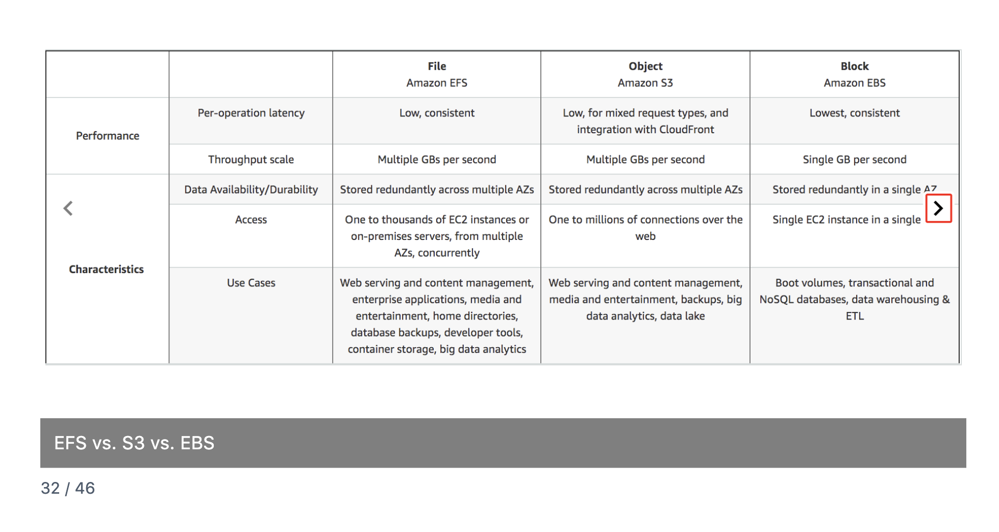
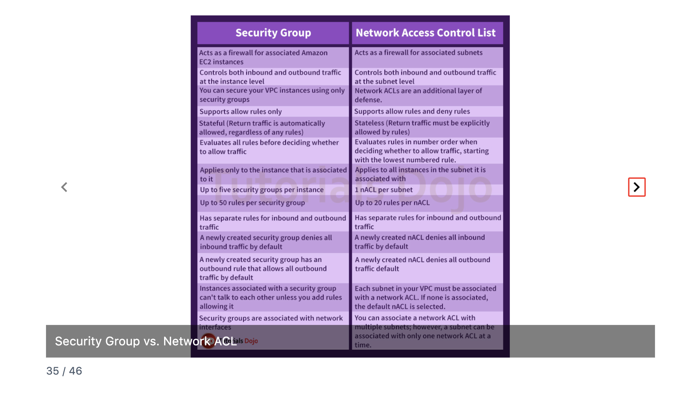
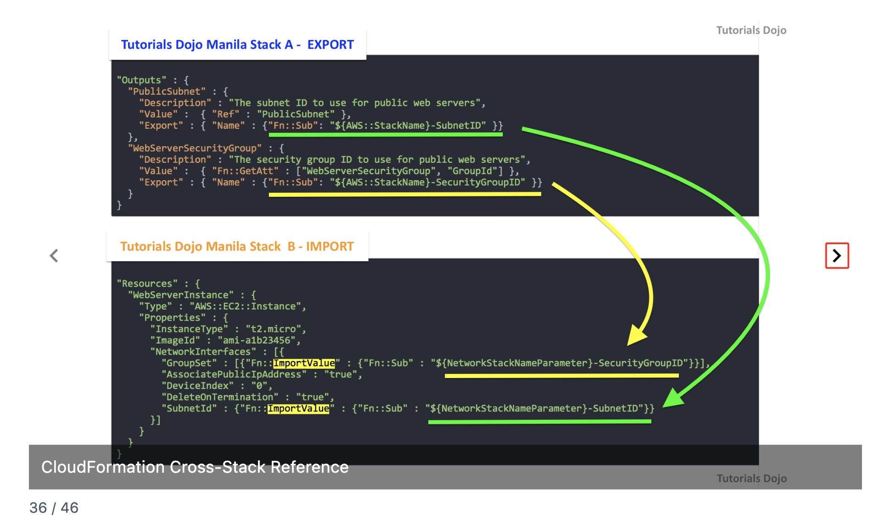
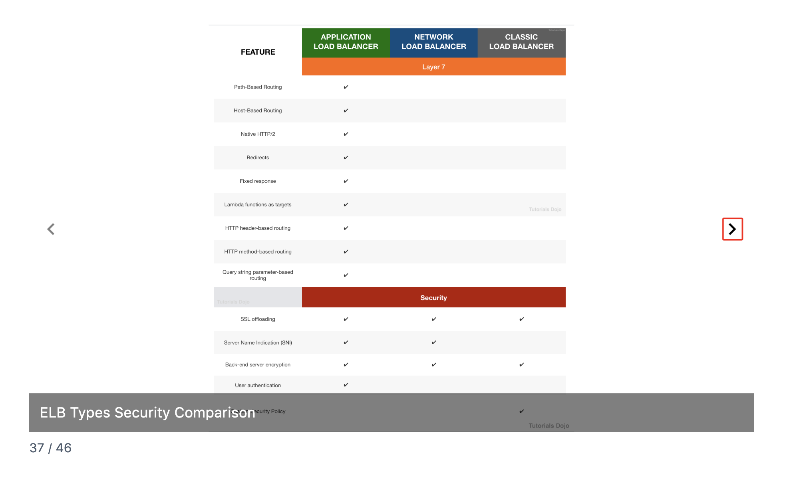

# AWS CloudOps Exam Study Notes
## Flashcards 31-40 Quick Reference

---

## 31. Dedicated Instances vs Dedicated Hosts


**What they solve:** Compliance and licensing requirements for dedicated physical hardware.

**The Analogy:**

| Dedicated Instances | Dedicated Hosts |
|---------------------|-----------------|
| Renting a private hotel room | Renting the entire hotel |
| You know no one shares your room | You see all room numbers, control everything |
| Hotel assigns your room | You control the whole property |

**Key Differences:**

| Feature | Dedicated Instances | Dedicated Hosts |
|---------|---------------------|-----------------|
| Dedicated physical server | ✅ Yes | ✅ Yes |
| See sockets, cores, host ID | ❌ No | ✅ Yes |
| BYOL (Bring Your Own License) | ❌ No | ✅ Yes |
| Control instance placement | ❌ No | ✅ Yes |
| Billing | Per instance + $2/region | Per host |
| Cost | Lower | Higher |

**The #1 Exam Distinction: BYOL**

Per-socket or per-core licenses (Windows Server, SQL Server, Oracle) require visibility into physical hardware → **Dedicated Hosts only**.

**Exam Triggers:**
- "Bring your own license" → Dedicated Hosts
- "Per-core licensing" → Dedicated Hosts
- "Dedicated hardware, no licensing needs" → Dedicated Instances (cheaper)
- "Visibility into physical hardware" → Dedicated Hosts

---

## 32. EFS vs S3 vs EBS



**Storage Types:**

| Type | Service | Analogy |
|------|---------|---------|
| **File** | EFS | Shared network drive |
| **Object** | S3 | Cloud storage (Dropbox) |
| **Block** | EBS | Hard drive for one computer |

**Key Differences:**

| Feature | EFS | S3 | EBS |
|---------|-----|----|----|
| Access | Multiple EC2 across AZs | Millions via web | Single EC2, single AZ |
| Durability | Multi-AZ | Multi-AZ | Single AZ |
| Boot volume? | ❌ No | ❌ No | ✅ Yes |
| Auto-scales? | ✅ Yes | ✅ Yes | ❌ No |
| Concurrent access | ✅ Thousands | ✅ Millions | ❌ One instance |

**Critical Exam Trap — EBS and AZ Failure:**

EBS is single-AZ. If AZ fails, EBS volume is unavailable/lost. Solution: Use EBS **snapshots** (stored in S3, survives AZ failure).

**Exam Triggers:**
- "Shared storage across instances" → EFS
- "Boot volume" → EBS
- "Static website hosting" → S3
- "Database storage" → EBS
- "Survives AZ failure" → EFS or S3 (not EBS without snapshots)

---

## 33. Elastic Beanstalk Deployment Options


**Five Deployment Methods:**

| Method | Downtime? | Rollback | Speed | Cost |
|--------|-----------|----------|-------|------|
| **All at once** | ❌ Yes | Manual redeploy | Fastest | No extra |
| **Rolling** | ⚠️ Reduced capacity | Manual redeploy | Medium | No extra |
| **Rolling + batch** | ✅ No | Manual redeploy | Medium | Slight extra |
| **Immutable** | ✅ No | Terminate new instances | Slower | Double briefly |
| **Blue/Green** | ✅ No | Swap URL back | Slowest | Double longer |

**Rollback Comparison:**

| Method | Rollback Process |
|--------|------------------|
| All at once, Rolling, Rolling+batch | Manual redeploy previous version |
| **Immutable** | Terminate new instances ✅ Fast |
| **Blue/Green** | Swap URL back ✅ Fastest |

**Exam Triggers:**
- "Zero downtime" → Rolling+batch, Immutable, or Blue/Green
- "Fastest rollback" → Blue/Green or Immutable
- "Maintain full capacity" → Rolling+batch, Immutable, or Blue/Green
- "Cheapest, downtime OK" → All at once
- "No DNS change" → NOT Blue/Green

---

## 34. SSD vs HDD (EBS Volume Types)


**Core Distinction:**

| | SSD | HDD |
|-|-----|-----|
| **Optimized for** | IOPS (small, random I/O) | Throughput (large, sequential I/O) |
| **Boot volume?** | ✅ Yes | ❌ No |
| **Cost** | Higher | Lower |
| **Use case** | Databases, transactions | Big data, logs, streaming |

**EBS Volume Types:**

| Category | Type | API | Best For | Max IOPS |
|----------|------|-----|----------|----------|
| SSD | General Purpose | gp2/gp3 | Most workloads, boot | 16,000 |
| SSD | Provisioned IOPS | io1/io2 | Databases, critical | 64,000 |
| HDD | Throughput Optimized | st1 | Big data, streaming | 500 |
| HDD | Cold HDD | sc1 | Infrequent, cheapest | 250 |

**Memory Trick:**
- **I**OPS → **I**O1/IO2 or GP
- **T**hroughput → S**T**1
- **C**heapest → S**C**1
- **B**oot → SSD only

**Exam Triggers:**
- "Boot volume" → gp2/gp3 or io1/io2 (SSD only)
- "High IOPS database" → io1/io2
- "Big data, log processing" → st1
- "Cheapest storage" → sc1

---

## 35. Security Group vs NACL



**The Analogy:**

| Security Group | NACL |
|----------------|------|
| 🚪 Front door to your house | 🚧 Gate to the neighborhood |
| Protects one instance | Protects entire subnet |
| Remembers visitors (stateful) | Amnesia every time (stateless) |

**Key Differences:**

| Feature | Security Group | NACL |
|---------|----------------|------|
| **Level** | Instance (ENI) | Subnet |
| **Stateful/Stateless** | Stateful | Stateless |
| **Rules** | Allow only | Allow AND Deny |
| **Rule evaluation** | All rules evaluated | Number order (first match) |
| **Default inbound** | Deny all | Deny all |
| **Default outbound** | Allow all | Deny all |

**Stateful vs Stateless:**

| Security Group (Stateful) | NACL (Stateless) |
|---------------------------|------------------|
| Inbound allowed → Outbound auto-allowed | Inbound allowed → Still need outbound rule |
| "Remembers the conversation" | "Amnesia — check badge again" |

**Exam Trap:** NACL needs outbound rule for **ephemeral ports** (1024-65535) for response traffic.

**Exam Triggers:**
- "Block specific IP" → NACL (SG can't deny)
- "Return traffic blocked" → NACL missing outbound rule
- "Instance-level firewall" → Security Group
- "Subnet-level firewall" → NACL

---

## 36. CloudFormation Cross-Stack Reference



**What it is:** One stack exports values, another stack imports them.

**The Analogy:**

| Nested Stacks | Cross-Stack References |
|---------------|------------------------|
| Parent & children in one house | Neighbors sharing tools |
| Parent owns/controls children | Independent stacks |
| Delete parent = children deleted | Separate lifecycles |

**How It Works:**

```
Stack A (EXPORTS):
  "Export": { "Name": "MyVPCID" }

Stack B (IMPORTS):
  { "Fn::ImportValue": "MyVPCID" }
```

**Key Rules:**
- Export names must be unique (per region, per account)
- Can't delete Stack A if Stack B imports from it
- Same region and account only

**Exam Triggers:**
- "Share values between stacks" → Cross-stack reference
- "Can't delete stack" → Another stack importing its exports
- "Reuse network resources across stacks" → Cross-stack reference

---

## 37. ELB Types Security Comparison



**Security Features:**

| Feature | ALB | NLB | CLB |
|---------|-----|-----|-----|
| SSL Offloading | ✅ | ✅ | ✅ |
| SNI (multiple certs) | ✅ | ✅ | ❌ |
| Back-end encryption | ✅ | ✅ | ✅ |
| User authentication | ✅ | ❌ | ❌ |

**SNI (Server Name Indication):**

Multiple SSL certificates on ONE load balancer.

| Without SNI (CLB) | With SNI (ALB/NLB) |
|-------------------|-------------------|
| 1 LB = 1 certificate | 1 LB = many certificates |
| 5 domains = 5 CLBs 💰 | 5 domains = 1 ALB 💵 |

**User Authentication:** Only ALB can authenticate users directly with Cognito/OIDC.

**Exam Triggers:**
- "Multiple SSL certs on one LB" → ALB or NLB (SNI)
- "Authenticate users at load balancer" → ALB only
- "End-to-end encryption" → Enable back-end server encryption

---

## 38. IAM Dashboard — Account Alias


**What it is:** Friendly name that replaces 12-digit account ID in IAM sign-in URL.

**The Problem:**
```
Without: https://120618981206.signin.aws.amazon.com/console
With:    https://tutorialsdojo.signin.aws.amazon.com/console
```

**Key Facts:**
- Must be globally unique across all AWS accounts
- One alias per account
- Only affects IAM user sign-in URL (not root)

**Exam Triggers:**
- "Friendly sign-in URL" → Account Alias
- "Replace account ID in login URL" → Account Alias

---

## 39. CloudFormation Drift Detection


**What is Drift?** Someone changed a resource manually outside of CloudFormation. Template no longer matches reality.

**The Analogy:**
```
Blueprint says: 5 windows
Building has: 6 windows (someone added one manually)
DRIFT = Blueprint ≠ Reality
```

**Drift Status:**
- **IN_SYNC** — Matches template ✅
- **MODIFIED** — Someone changed it ⚠️
- **DELETED** — Resource was deleted ❌

**How to Fix Drift:**
- Manually revert the change
- Update template to match reality
- Update stack to overwrite changes

**Exam Triggers:**
- "Resources modified outside CloudFormation" → Drift Detection
- "Template doesn't match actual resources" → Drift
- "Stack update failing after manual changes" → Run Drift Detection

---

## 40. S3 Glacier Vault Lock


**What it is:** Makes a policy IMMUTABLE (unchangeable) for compliance. Once locked, nobody can change it — not even root.

**WORM = Write Once, Read Many**
- Write data once
- Cannot modify or delete until retention expires
- Required for SEC, HIPAA, FINRA compliance

**Vault Lock Process:**
```
Create policy → Initiate lock → 24-hour test period → Complete lock → PERMANENT
```

**The 24-hour window:** Test before it's permanent. After completion, no going back.

**Key Points:**
- Once locked, policy CANNOT be changed
- Even root user can't modify it
- 24-hour window to abort if policy is wrong
- No way to unlock once completed

**Exam Triggers:**
- "Compliance requires immutable retention" → Vault Lock
- "WORM storage" → Vault Lock
- "Data cannot be deleted for X years" → Vault Lock
- "Even administrators cannot delete" → Vault Lock

---

## Quick Exam Decision Guide

| When you see... | Think... |
|-----------------|----------|
| "Bring your own license" | Dedicated Hosts |
| "Dedicated hardware, no BYOL" | Dedicated Instances |
| "Shared storage across EC2" | EFS |
| "Boot volume" | EBS |
| "AZ failure + EBS" | Need snapshots for recovery |
| "Zero downtime deployment" | Rolling+batch, Immutable, Blue/Green |
| "Fastest rollback" | Blue/Green or Immutable |
| "High IOPS database" | io1/io2 |
| "Cheapest EBS storage" | sc1 |
| "Block specific IP" | NACL |
| "Stateful firewall" | Security Group |
| "Response traffic blocked" | NACL outbound rule missing |
| "Share values between stacks" | Cross-stack reference (Export/ImportValue) |
| "Multiple SSL certs, one LB" | ALB or NLB (SNI) |
| "Authenticate at load balancer" | ALB |
| "Friendly IAM sign-in URL" | Account Alias |
| "Resources changed outside CloudFormation" | Drift Detection |
| "Immutable compliance policy" | Glacier Vault Lock |
| "WORM storage" | Glacier Vault Lock |