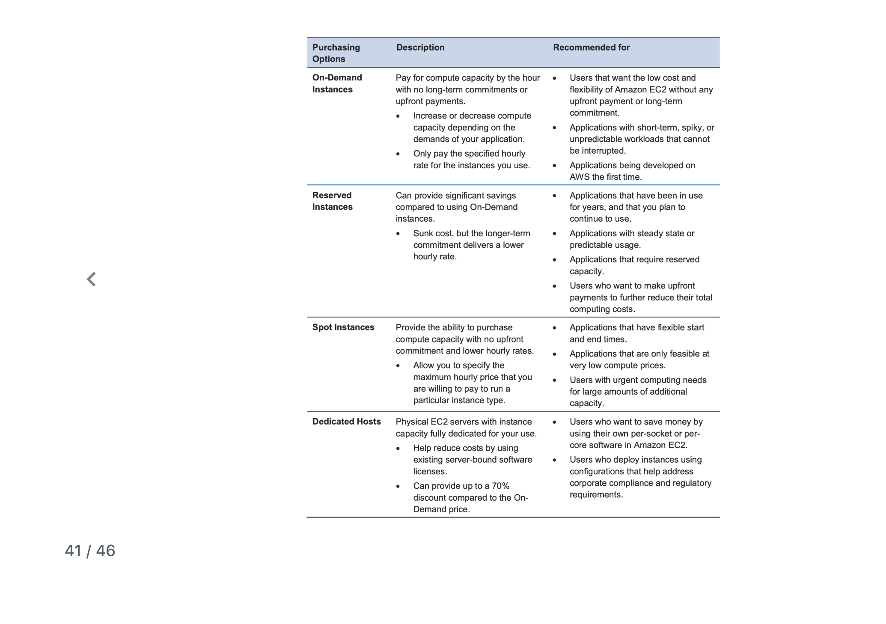
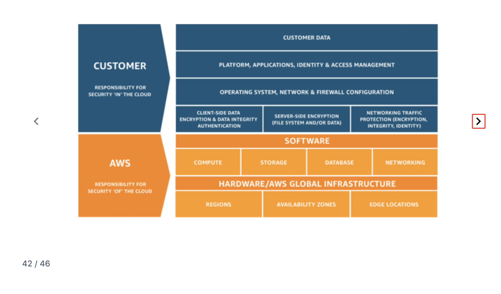
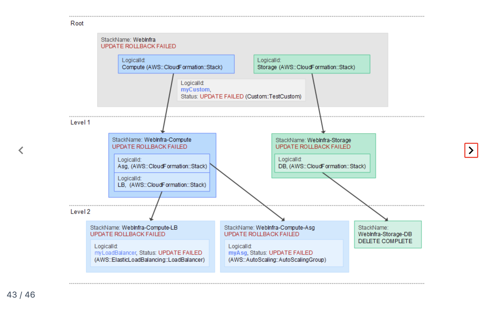
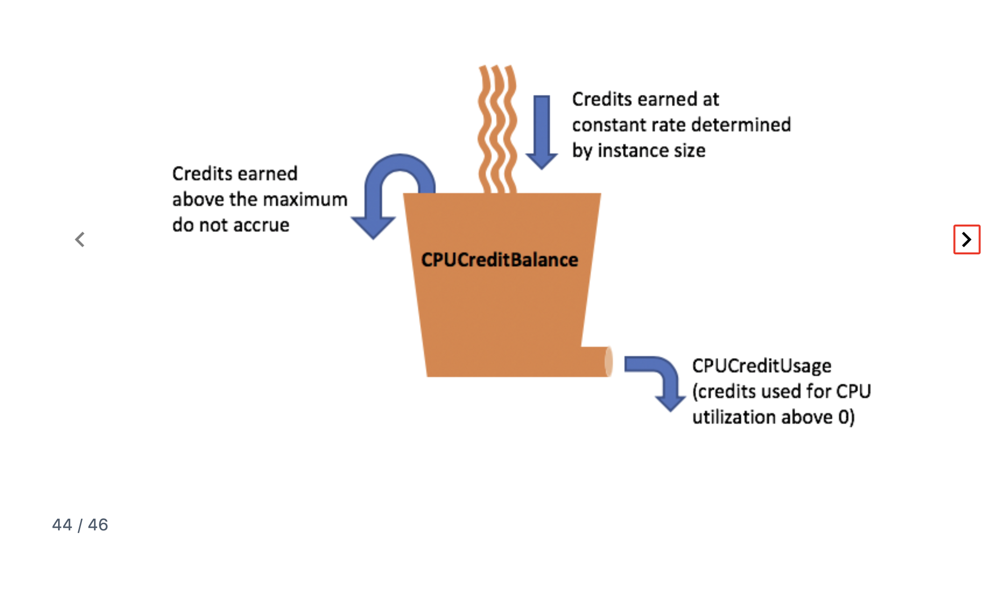
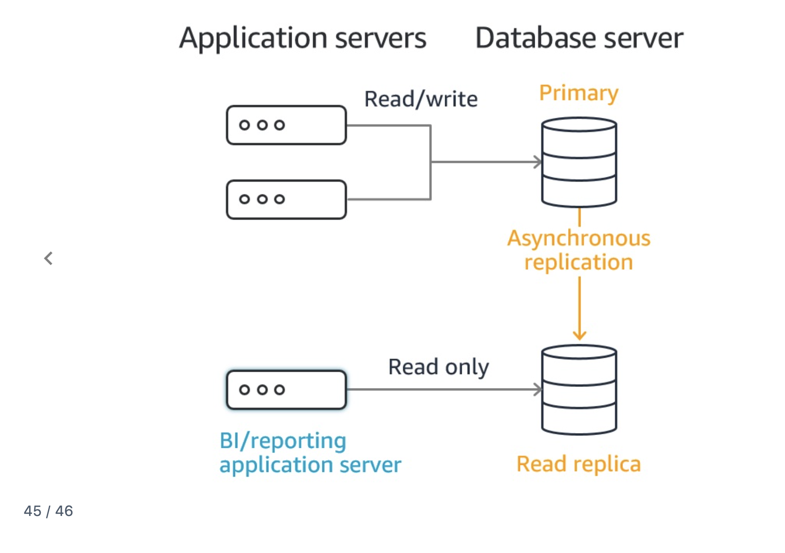

# AWS CloudOps Exam Study Notes
## Flashcards 41-46 Quick Reference

---

## 41. EC2 Instance Purchasing Options



**Four Main Purchasing Options:**

| Option | Commitment | Discount | Best For |
|--------|------------|----------|----------|
| **On-Demand** | None | None (full price) | Short-term, unpredictable, can't be interrupted |
| **Reserved** | 1 or 3 years | Up to 72% | Steady-state, predictable usage |
| **Spot** | None | Up to 90% | Flexible, can be interrupted |
| **Dedicated Hosts** | Per host | Up to 70% | BYOL, compliance |

**On-Demand:**
- Pay by the hour/second
- No commitment
- Most flexible, most expensive
- Use for: Dev/test, unpredictable workloads, first-time apps

**Reserved Instances:**
- 1 or 3 year commitment
- Significant savings
- Use for: Databases, steady-state apps, predictable workloads

**Spot Instances:**
- Bid on unused AWS capacity
- Can be interrupted with 2-minute warning
- Use for: Batch jobs, data analysis, flexible workloads
- NOT for: Critical apps, databases

**Dedicated Hosts:**
- Physical server dedicated to you
- Use for: BYOL licensing, compliance requirements

**Exam Triggers:**
- "Lowest cost, can be interrupted" → Spot
- "Predictable, steady usage" → Reserved
- "No commitment, pay as you go" → On-Demand
- "Bring your own license" → Dedicated Hosts

---

## 42. Shared Responsibility Model



**The Core Concept:**

| AWS Responsibility | Customer Responsibility |
|--------------------|------------------------|
| Security **OF** the cloud | Security **IN** the cloud |
| Infrastructure | What you build on it |

**AWS Manages (Orange):**

| Layer | Examples |
|-------|----------|
| Hardware | Physical servers, storage |
| Global Infrastructure | Regions, AZs, Edge Locations |
| Software | Hypervisor, managed service internals |

**Customer Manages (Blue):**

| Layer | Examples |
|-------|----------|
| Customer Data | Your files, databases |
| Applications | Your code, configurations |
| IAM | Users, roles, policies |
| OS & Network | EC2 patches, security groups, NACLs |
| Encryption | Client-side, server-side choices |

**Service-Specific Responsibility:**

| Service | Who Patches OS? |
|---------|-----------------|
| EC2 | Customer |
| RDS | AWS |
| Lambda | AWS |

**Memory Trick:**
- "Can I touch it in the console?" → Probably YOUR responsibility
- "Physical/infrastructure layer?" → AWS responsibility

**Exam Triggers:**
- "Who patches EC2 OS?" → Customer
- "Who secures data centers?" → AWS
- "Who manages IAM policies?" → Customer
- "Who patches RDS database engine?" → AWS

---

## 43. CloudFormation Nested Stacks & UPDATE_ROLLBACK_FAILED



**Nested Stacks:** Stacks within stacks. Parent creates child stacks.

```
Root Stack
    ├── Child Stack (Compute)
    │       ├── Grandchild (LB)
    │       └── Grandchild (ASG)
    └── Child Stack (Storage)
            └── Grandchild (DB)
```

**Why Use Nested Stacks:**
- Break large templates into manageable pieces
- Reuse common components
- Organized by function (network, compute, storage)

**UPDATE_ROLLBACK_FAILED — The Nightmare State:**

```
Update fails → CloudFormation tries rollback → Rollback ALSO fails → STUCK
```

**Common Causes:**
- Resource manually deleted outside CloudFormation
- Resource state changed
- Permission issues
- Resource limits hit

**How to Fix:**

| Option | When to Use |
|--------|-------------|
| **Continue Update Rollback + Skip** | Skip problematic resources, complete rollback |
| **Fix underlying issue** | Manually fix, then retry rollback |

**Exam Triggers:**
- "Stack stuck in UPDATE_ROLLBACK_FAILED" → Continue Update Rollback, skip resources
- "Break up large CloudFormation template" → Nested stacks
- "Child stack failed" → Check child for root cause, affects parent

---

## 44. T-Series Burstable Instances — CPU Credits



**What Are Burstable Instances?**

T-series (t2, t3, t3a) earn CPU credits when idle, spend them when busy.

**The Bucket Analogy:**

```
Credits IN (earned constantly) → Bucket (balance) → Credits OUT (spent on CPU)
```

**How It Works:**

| Situation | Result |
|-----------|--------|
| CPU below baseline | Earning credits 💰 |
| CPU above baseline | Spending credits 📉 |
| Credits = 0 (Standard) | Throttled to baseline 🐌 |
| Credits = 0 (Unlimited) | Keeps bursting, but costs 💸 |

**Baseline Performance:**

| Instance | Baseline |
|----------|----------|
| t3.micro | 10% |
| t3.small | 20% |
| t3.medium | 20% |

**Standard vs Unlimited Mode:**

| Mode | Credits Run Out | Extra Cost? |
|------|-----------------|-------------|
| Standard | Throttled | No |
| Unlimited | Keeps bursting | Yes |

**CloudWatch Metrics:**
- **CPUCreditBalance** — Credits saved
- **CPUCreditUsage** — Credits being spent

**When NOT to Use T-Series:**
- Consistent high CPU usage → Use M-series or C-series instead

**Exam Triggers:**
- "T3 instance running slow" → Check CPUCreditBalance (likely zero)
- "Burstable performance" → T-series
- "Consistent 80% CPU" → Don't use T-series, use M/C-series

---

## 45. RDS Read Replicas — Offloading Read Traffic



**The Pattern:**

```
Production App ──── Read/Write ────► Primary DB
                                         │
                               Async replication
                                         │
BI/Reporting ─────── Read Only ────► Read Replica
```

**Why This Architecture:**
- Heavy reports don't slow down production
- Production stays fast
- Reporting gets dedicated resources

**Key Points:**

| Component | Role |
|-----------|------|
| Primary | All writes + production reads |
| Read Replica | Reporting/analytics (read-only) |
| Async Replication | Slight delay OK for reporting |

**Why Asynchronous Is Fine:**
- Reports don't need real-time data
- Few seconds behind is acceptable

**Exam Triggers:**
- "Reports slowing down production" → Read Replica
- "Offload analytics queries" → Read Replica
- "BI team needs access without impacting app" → Read Replica

---

## 46. IAM Best Practices


**Root User Security:**
- Lock away root access keys
- Enable MFA on root
- Only use root when absolutely required

**User Management:**
- Create individual IAM users (no sharing)
- Use groups to assign permissions
- Don't share access keys

**Least Privilege:**
- Grant minimum permissions needed
- Review and audit permissions regularly
- Remove unnecessary credentials

**Credentials Management:**
- Strong password policy
- Rotate credentials regularly
- Use IAM roles for EC2 (no hardcoded keys!)

**Top 5 Exam Favorites:**

| Best Practice | Exam Scenario |
|---------------|---------------|
| **Least privilege** | "Too many permissions" → Reduce to minimum |
| **Use roles for EC2** | "App needs S3 access" → IAM Role |
| **MFA for admins** | "Secure admin accounts" → Enable MFA |
| **Don't use root** | "Daily tasks" → Use IAM user |
| **Use groups** | "50 developers, same permissions" → Create group |

**Exam Triggers:**
- "EC2 app needs AWS access" → IAM Role (NOT access keys)
- "Manage permissions for many users" → Groups
- "Minimum permissions" → Least privilege
- "Secure privileged accounts" → MFA

---

## Quick Exam Decision Guide

| When you see... | Think... |
|-----------------|----------|
| "Lowest cost, can be interrupted" | Spot Instances |
| "Steady, predictable workload" | Reserved Instances |
| "BYOL licensing" | Dedicated Hosts |
| "Who patches EC2 OS?" | Customer |
| "Who secures physical servers?" | AWS |
| "Stack stuck, can't rollback" | Continue Update Rollback + skip resources |
| "T3 instance slow, credits at zero" | Throttled — need larger instance or unlimited mode |
| "Consistent high CPU on T-series" | Switch to M/C-series |
| "Reports slowing production DB" | Read Replica |
| "EC2 app needs S3 access" | IAM Role |
| "Manage permissions for 100 users" | Groups |
| "Minimum permissions needed" | Least privilege |

---

## 🎉 Congratulations!

You've completed all 46 flashcards!

**All Study Guides:**
- 01-study-guide.md (#1-10)
- 02-study-guide.md (#11-20)
- 03-study-guide.md (#21-30)
- 04-study-guide.md (#31-40)
- 05-study-guide.md (#41-46)

**Good luck on your AWS SysOps Administrator exam!**